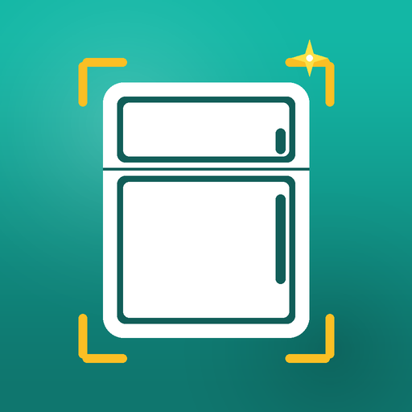
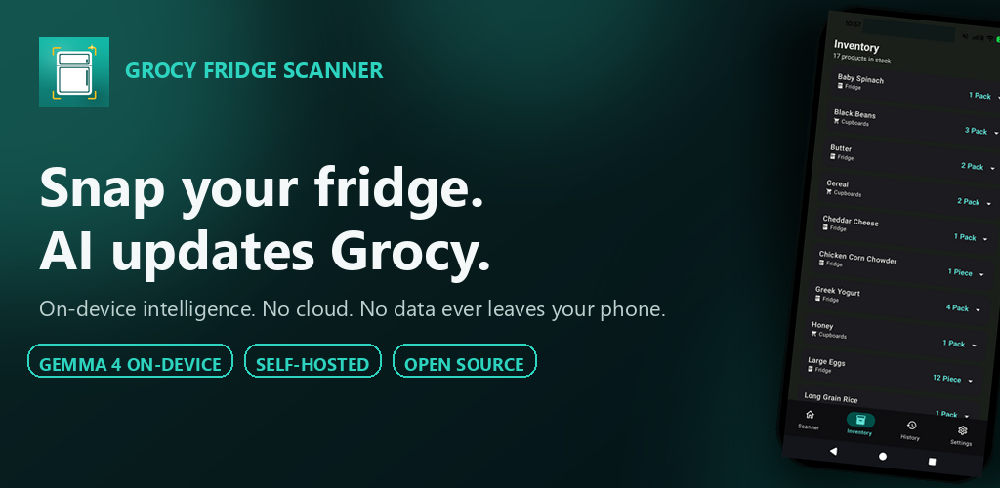
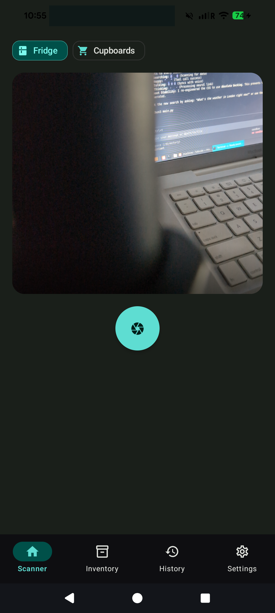
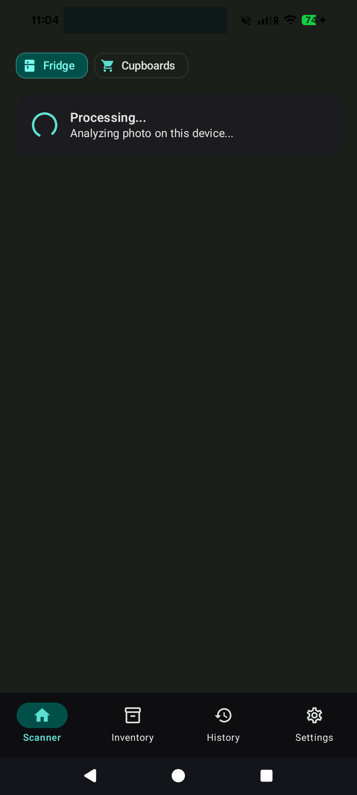
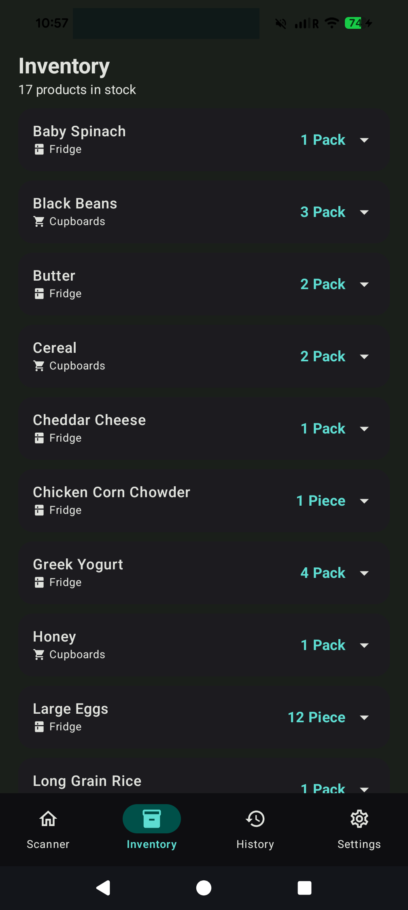
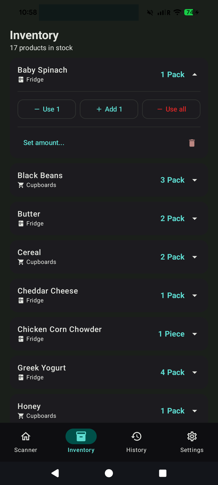
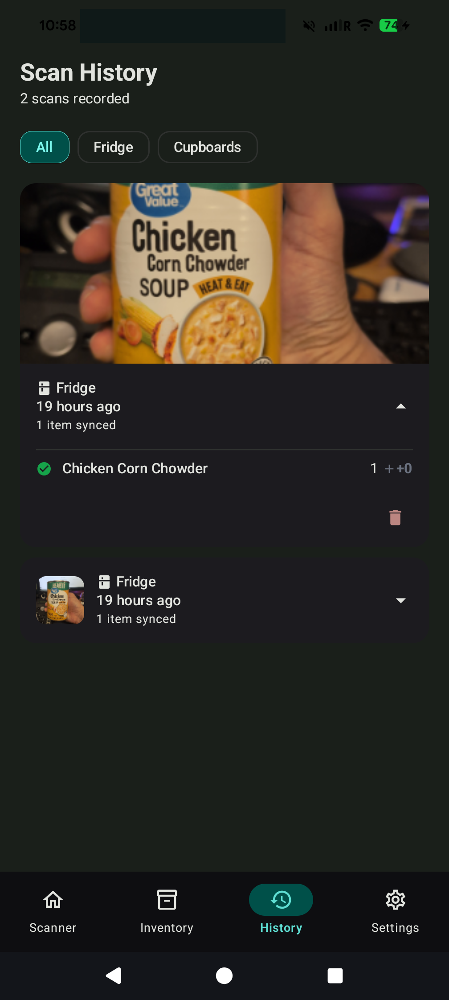
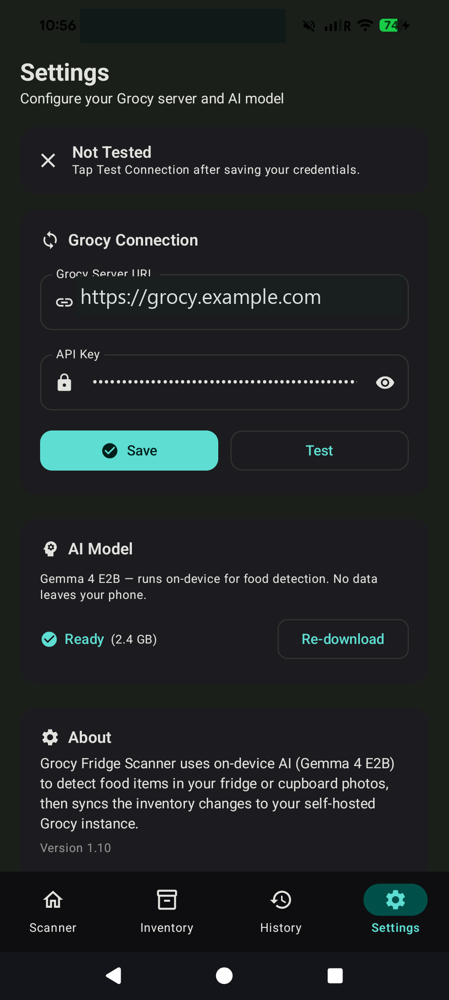

<div align="center">



# Grocy Fridge Scanner

**AI-powered fridge & cupboard inventory scanner for Grocy**

Scan your fridge or cupboard with your phone camera. On-device AI detects food items and syncs inventory changes directly to your self-hosted Grocy instance.

[](https://developer.android.com)
[](https://kotlinlang.org)
[](https://developer.android.com/jetpack/compose)
[](https://ai.google.dev/gemma)
[](https://github.com/chartmann1590/GrocyFridgeScanner/releases/latest)
[](https://play.google.com/store/apps/details?id=com.charleshartmann.grocyfridge)

[](https://play.google.com/store/apps/details?id=com.charleshartmann.grocyfridge)

**[Get it on Google Play](https://play.google.com/store/apps/details?id=com.charleshartmann.grocyfridge)** · **[Download APK](https://github.com/chartmann1590/GrocyFridgeScanner/releases/latest)** · [View all releases](https://github.com/chartmann1590/GrocyFridgeScanner/releases)



</div>

---

## Feature Video

<div align="center">

[](https://youtu.be/WAUOUU3Bvu0)

**[Watch on YouTube](https://youtu.be/WAUOUU3Bvu0)**

</div>

---

## Screenshots

<div align="center">

| Scanner | Analyzing | Inventory |
|:---:|:---:|:---:|
|  |  |  |

| Quick Actions | History | Settings |
|:---:|:---:|:---:|
|  |  |  |

</div>

---

## Features

### Scanning & AI Detection

- **Camera Scanning** — Point your phone at a fridge shelf or cupboard and take a photo
- **On-Device AI** — Gemma 4 E2B runs entirely on your phone with GPU acceleration. No cloud, no data leaves your device
- **Smart Detection** — Identifies food items, counts retail units (bags, boxes, cans, jars, bottles), and proposes inventory changes
- **Intelligent Grouping** — Duplicate detections are merged automatically using fuzzy name matching ("chips", "Chips", "chip" → same product)
- **Robust JSON Parsing** — Multi-strategy parser handles malformed AI output: bare arrays, trailing commas, missing braces, and more
- **Location Selector** — Toggle between Fridge and Cupboards to tag items by storage location

### Review & Sync

- **Review Before Sync** — Every proposed change is shown with color-coded deltas (+/−). Edit names, adjust counts, or exclude items before syncing
- **Smart Skip** — Items already at the correct count (delta = 0) are skipped automatically
- **Auto Product Creation** — If a detected food doesn't exist in Grocy, it's created with the right quantity unit (Pack or Piece) and location
- **Auto Location Creation** — "Fridge" and "Cupboards" locations are created in Grocy automatically if they don't exist
- **Container-to-Unit Mapping** — Bags, boxes, and packs → "Pack" unit; everything else → "Piece" unit
- **Inventory Notes** — Synced items are tagged with "Updated by fridge scanner photo"

### Inventory Management

- **Full Stock View** — Browse all Grocy stock items sorted alphabetically with expandable detail cards
- **Quick Actions** — Use 1, Add 1, Use All, or set an arbitrary amount for any product
- **Delete Products** — Remove products from Grocy with confirmation dialog
- **Location & Unit Display** — Each product shows its Grocy location and quantity unit

### Scan History

- **Full History** — Every scan is recorded with timestamps, photo thumbnails, and item-level details
- **Failed Scan Tracking** — Failed scans are saved with error messages and a Retry button
- **Smart Retry** — Retries sync-only if product data exists, or re-analyzes the photo from scratch
- **History Filtering** — Filter scans by All, Fridge, or Cupboards
- **Relative Timestamps** — "Just now", "5 minutes ago", "2 hours ago", etc.
- **25-Record Cap** — Oldest records are pruned automatically

### Settings & Connection

- **Connection Testing** — Test your Grocy connection with version display and specific error messages (wrong API key, bad URL, server down)
- **Encrypted Storage** — API key stored with AES256-GCM encryption via EncryptedSharedPreferences
- **Show/Hide API Key** — Eye icon toggle for password visibility
- **HTTP Support** — Cleartext network access enabled for local/non-HTTPS Grocy instances
- **Model Management** — View download status, progress, model size, or re-download the AI model
- **Model Validation** — Downloaded model files are validated for integrity (size check)

### Onboarding

- **2-Step Wizard** — Guided setup: (1) Connect Grocy, (2) Download AI model
- **Test During Setup** — Test your connection directly from the onboarding screen
- **Auto-Advance** — Skips to model download if Grocy is already configured via `local.properties`
- **Skip Option** — "Skip for now" to start using the app immediately

## Requirements

- **Android 12+** (API 31)
- **Grocy** — A running [Grocy](https://grocy.info) instance with API access
- **~1.5 GB storage** — For the on-device AI model (downloaded during setup)

## Setup

### 1. Clone & Build

```bash
git clone https://github.com/chartmann1590/GrocyFridgeScanner.git
cd GrocyFridgeScanner
```

Create a `local.properties` file with your Grocy server details (optional — you can also enter these in the app):

```properties
grocy.url=https://your-grocy-instance.com
grocy.apiKey=your-api-key-here
```

Build and install on a connected device:

```bash
./gradlew assembleDebug
adb install app/build/outputs/apk/debug/app-debug.apk
```

### 2. First Launch

1. The app opens to a 2-step onboarding wizard
2. Enter your Grocy server URL and API key (or it uses `local.properties` defaults if set)
3. Test your connection to verify everything works
4. The AI model downloads to your device (~1.5 GB) with progress tracking
5. Start scanning

## How It Works

```
┌─────────────┐     ┌──────────────────┐     ┌─────────────────┐     ┌──────────────┐
│  Take Photo  │────▶│  Gemma 4 E2B     │────▶│  Review & Edit  │────▶│  Sync Grocy  │
│  (CameraX)   │     │  (On-Device AI   │     │  (Proposed      │     │  (REST API)  │
│              │     │   + GPU Accel)   │     │   changes with  │     │              │
│              │     │  Detects items,  │     │   +/− deltas)   │     │              │
│              │     │  counts, and     │     │                 │     │              │
│              │     │  container types │     │                 │     │              │
└─────────────┘     └──────────────────┘     └─────────────────┘     └──────────────┘
```

1. **Capture** — CameraX takes a photo of your fridge or cupboard
2. **Analyze** — Gemma 4 E2B (via LiteRT) runs GPU-accelerated inference on-device, returning detected food items with counts
3. **Match** — Detected items are matched against existing Grocy products using fuzzy name normalization. Unmatched items are flagged as new products
4. **Review** — Proposed inventory changes are shown with current → photo count deltas. You can edit, toggle, or cancel before committing
5. **Sync** — Selected changes are pushed to Grocy via the inventory API. Items with zero delta are skipped. New products and locations are created automatically

## Tech Stack

| Layer | Technology |
|-------|-----------|
| UI | Jetpack Compose, Material 3 (light & dark theme), Navigation Compose |
| Camera | CameraX (Preview + ImageCapture) |
| AI Inference | LiteRT LM (Gemma 4 E2B) with GPU acceleration |
| Networking | Retrofit + OkHttp + Kotlinx Serialization |
| Security | Encrypted SharedPreferences (AES256-GCM) |
| Storage | DataStore Preferences |
| Architecture | MVVM (ViewModel + StateFlow) |
| Image Loading | Coil |

## Configuration

All settings are accessible from the Settings tab:

- **Grocy Server URL** — Your self-hosted Grocy base URL (HTTP or HTTPS)
- **API Key** — Generated from your Grocy instance (Settings → API Keys), stored encrypted
- **Test Connection** — Verify connectivity and see your Grocy version
- **AI Model** — View download status, progress, model size, or re-download the model

## License

This project is licensed under the MIT License. See [LICENSE](LICENSE) for details.

---

<div align="center">

Built with Kotlin, Jetpack Compose, and Gemma AI

**[Download on Google Play](https://play.google.com/store/apps/details?id=com.charleshartmann.grocyfridge)** · [GitHub](https://github.com/chartmann1590/GrocyFridgeScanner) · [Feature Video](https://youtu.be/WAUOUU3Bvu0)

</div>
